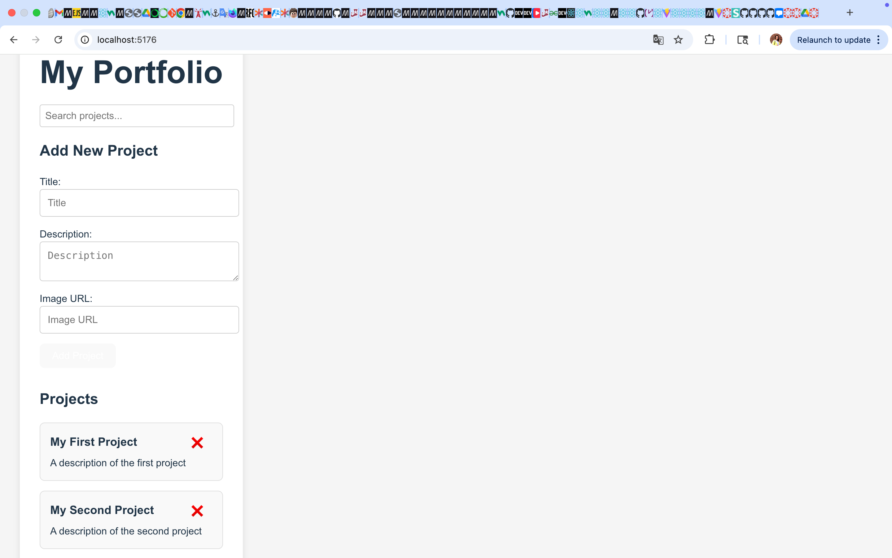

# React Portfolio App

This is a simple single-page React application that allows users to add, search, and delete projects. It was built using React, with form handling, state management, and basic automated testing.

## Features

-  Add new projects using a form
-  Search through projects by title
-  Delete individual projects
-  Unit tests using React Testing Library and Vitest

## Getting Started

### Installation

1. Clone the repository:
   ```bash
   git clone https://github.com/N252614/react-portfolio.git
   cd react-portfolio
   npm install
   npm run dev
   npm test
   ```
   Project Structure
react-portfolio/
├── public/
├── src/
│   ├── __tests__/        # App.test.jsx — all test cases
│   ├── assets/           # Static assets (e.g., logo)
│   ├── components/       # React components
│   │   ├── Header.jsx
│   │   ├── ProjectForm.jsx
│   │   ├── ProjectCard.jsx
│   │   ├── ProjectList.jsx
│   │   └── SearchBar.jsx
│   ├── App.jsx           # Main app component
│   ├── projects.js       # Sample project data
│   ├── main.jsx          # Entry point
│   └── index.css         # Basic styles
├── vite.config.js
├── package.json
└── README.md

## Technologies Used
 • React
 • Vite
 • JavaScript (ES6+)
 • React Testing Library
 • Vitest

## Screenshots
### Home With Projects


Adding a New Project
To add a new project:
 • Fill in the Title, Description, and Image URL fields in the form
 • Click Add Project
 • The new project will appear below the form
 
## The tests cover:
 • Header rendering
 • Project form presence
 • Adding a project
 • Deleting a project

Author
Nataliia Katina
GitHub: @N252614

⸻

License

This project is licensed for educational purposes as part of the Flatiron School Software Engineering course.